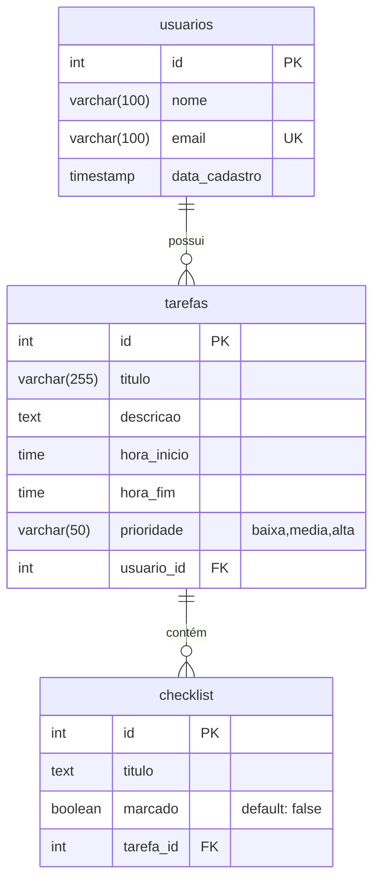
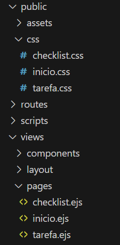
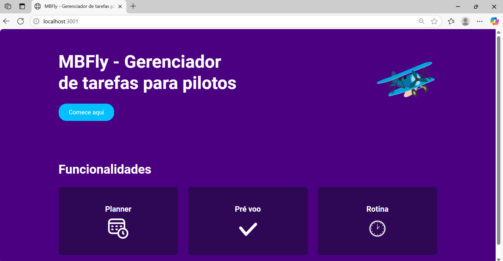
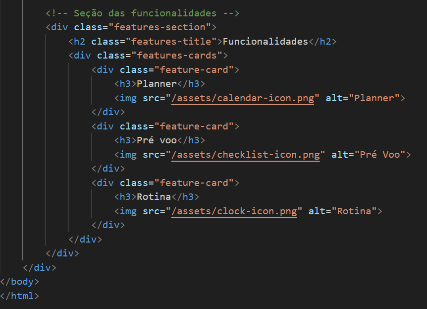
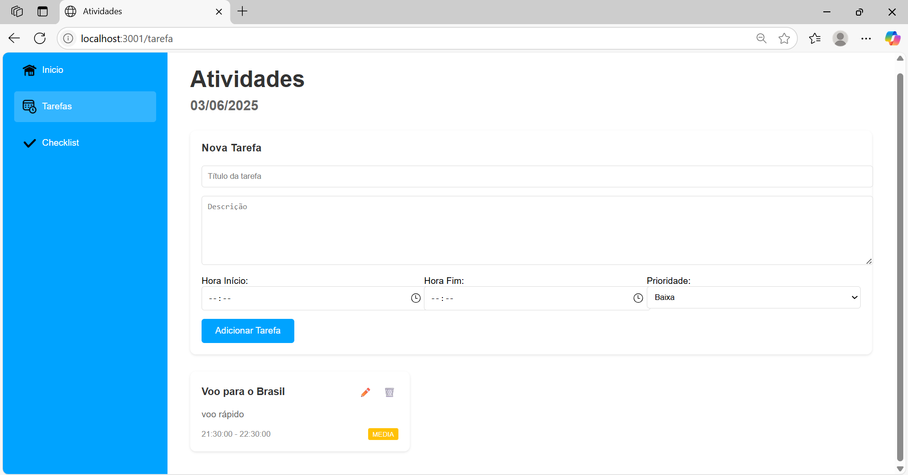
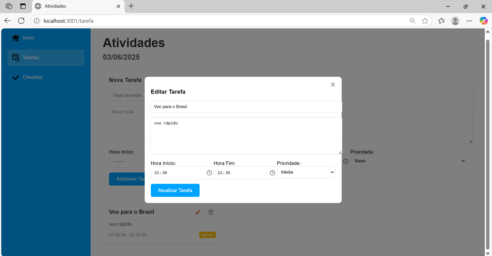
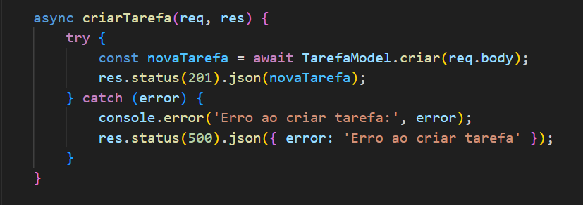
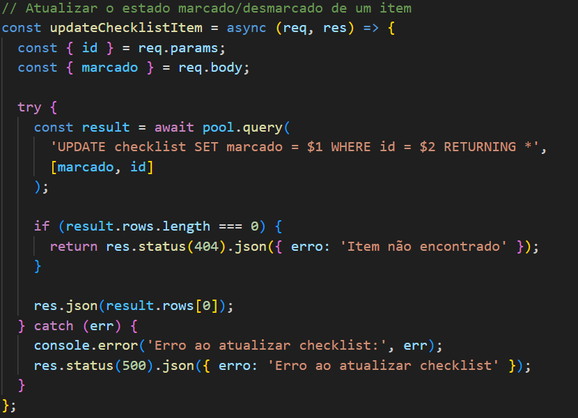

# Web Application Document - Projeto Individual - Módulo 2 - Inteli


## MBFly - Gerenciador de tarefas para organização e produtividade.

#### Mirela Schneider Bianchi

## Sumário

1. [Introdução](#c1)  
2. [Visão Geral da Aplicação Web](#c2)  
3. [Projeto Técnico da Aplicação Web](#c3)  
4. [Desenvolvimento da Aplicação Web](#c4)  
5. [Referências](#c5)  

<br>

## <a name="c1"></a>1. Introdução 

O sistema MBFly será um gerenciador de tarefas online voltado à organização pessoal e aumento da produtividade de pilotos de avião. De forma simples e intuitiva, permitirá ao usuário criar tarefas, definir prazos, organizá-las por categorias como voos, estudos, checagens e escalas, além de acompanhar seu progresso. Inspirado no nome da desenvolvedora, o MBFly busca unir funcionalidade e identidade, sendo ideal para pilotos que desejam deixar suas rotinas mais eficientes.

---

## <a name="c2"></a>2. Visão Geral da Aplicação Web

### 2.1. Personas 
Personas são representações fictícias de usuários reais, criadas com base em dados e perfis que refletem comportamentos, necessidades, objetivos e dores do público-alvo de um projeto. Elas ajudam a entender melhor quem são os usuários, o que esperam e como se relacionam com o produto. No contexto deste projeto, voltado para a organização e produtividade de pilotos, a construção de personas é essencial para criar soluções funcionais, personalizadas e eficazes, que acompanhem a rotina dinâmica e exigente desses profissionais.
<div align="center">
  <sub>Template da persona 1 com suas características</sub><br>
  <br>
  <sup>Fonte: Desenvolvido por Mirela Bianchi</sup>
</div>

Ao desenvolver personas como a Teresa, o projeto ganha direção e foco, permitindo decisões de design e funcionalidade mais assertivas. Elas servem como guias durante todo o processo de criação do sistema, garantindo que as ferramentas oferecidas realmente atendam às expectativas dos usuários reais, tornando o projeto mais humano, eficiente e alinhado com as necessidades da aviação profissional.

### 2.2. User Stories 

User Stories são descrições curtas e claras de funcionalidades, escritas do ponto de vista do usuário final. Elas ajudam a entender as necessidades do usuário, facilitando a criação de soluções que atendem diretamente aos seus objetivos e desafios.


| ID   | User Story Persona 1                                                                                                        | Critério de Aceite 1                                                                 | Critério de Aceite 2                                                                 |
|------|--------------------------------------------------------------------------------------------------------------------|---------------------------------------------------------------------------------------|---------------------------------------------------------------------------------------|
| US01 | Como piloto, quero cadastrar tarefas por categorias específicas (voo, descanso, pessoal), para que eu possa organizar melhor minha rotina. | O sistema permite selecionar uma categoria ao criar a tarefa.                         | As tarefas são listadas separadamente por categoria no painel.                       |
| US02 | Como piloto, quero visualizar meu calendário mensal com todas as tarefas, para que eu possa me planejar com antecedência.                     | O sistema exibe um calendário com todas as tarefas organizadas por data.              | É possível clicar em um dia específico e ver suas tarefas detalhadas.                |
| US03 | Como piloto, quero receber lembretes automáticos antes dos voos e eventos importantes, para que eu não perca nenhum compromisso.              | O sistema envia notificações com base no horário da tarefa.                           | O usuário pode configurar quanto tempo antes deseja receber o lembrete.              |
| US04 | Como piloto, quero acessar minha rotina e atividades por meio de um local seguro com design bem estruturado e funcional, para que somente eu tenha acesso às minhas informações e entenda o site.              | O sistema possui tela de inicio mostrando suas funcionalidades gerais.                           | O usuário tem que utilizar seu e-mail e senha individuais para acessar as suas informações.              |

---

### Análise INVEST – US01

**User Story:**
> Como piloto, quero cadastrar tarefas por categorias específicas (voo, descanso, pessoal), para que eu possa organizar melhor minha rotina.

| Critério  | Justificativa                                                                                       |
|-----------|-----------------------------------------------------------------------------------------------------|
| I – Independente | Pode ser implementada separadamente de outras funcionalidades, como calendário ou lembretes.   |
| N – Negociável   | As categorias podem ser ajustadas ou personalizadas conforme o feedback dos usuários.         |
| V – Valiosa      | Ajuda diretamente na organização do piloto, considerando sua rotina intensa e segmentada.    |
| E – Estimável    | Pode ser facilmente estimada durante o desenvolvimento com base nas funcionalidades requeridas. |
| S – Pequena      | A funcionalidade pode ser implementada em poucos passos: criação, edição e visualização por categoria. |
| T – Testável     | Pode ser testada criando tarefas com diferentes categorias e verificando se estão organizadas corretamente. |


Dessa forma, as User Stories são importantes para o projeto, pois garantem que as funcionalidades atendam às necessidades reais dos pilotos, melhorando a usabilidade e a relevância do sistema.

---

## <a name="c3"></a>3. Projeto da Aplicação Web

### 3.1. Modelagem do banco de dados 

##### Visão maximalista do diagrama do BD


##### Entidades e Relacionamentos:

Usuários (usuarios)
Representam os profissionais que utilizam o sistema:
- Perfil (piloto, comissário, mecânico) - define as permissões e tipos de tarefas acessíveis
- Dados cadastrais (nome, e-mail único)
- Data de cadastro - registro automático no sistema

Tarefas (tarefas)
Representam compromissos organizados por categoria:
- Categoria (voo, descanso, pessoal) - classificação principal
- Temporalidade (data, hora_início, hora_fim)
- Prioridade (baixa, média, alta) - gestão de urgência
- Status (pendente, concluído, cancelado) - acompanhamento

Checklist (checklist)
Representam verificações técnicas:
- Categoria aeronáutica (fuselagem, motor, cabine, trem_de_pouso)
- Controle (marcação booleana) - indica conclusão
- Descrição - detalhamento do item

Relacionamentos entre Tabelas
- Usuários → Tarefas (1:N)
- Um usuário pode cadastrar múltiplas tarefas
- Relacionamento implementado via usuario_id em tarefas
Exemplo: Um piloto cadastra tanto tarefas de voo quanto pessoais
- Tarefas → Checklist (1:N)
- Cada tarefa pode conter vários itens de verificação
- Vinculação através de tarefa_id em checklist
- Caso de uso: Uma tarefa de "preparação de voo" tem checklist específico para motor e cabine

#### Modelo físico com o Schema do BD
📥 [Schema SQL completo](../scripts/init.sql)

### 3.1.1 BD e Models 
Mesmo sem usar um ORM como o Sequelize, os models estão representados nas consultas SQL feitas nos controllers. Abaixo, mostramos como cada entidade é estruturada, com base nas operações de criação, leitura, atualização e remoção.

---

#### Campos e suas respectivas operações:
#### Usuários
**id**: inteiro, chave primária;
**nome**: texto, obrigatório;
**email**: texto, único, obrigatório;
**tipo_licenca***: texto, opcional;
**horas_voo_totais**: inteiro, padrão 0;
**aeroporto_base**: texto, opcional;

- Criar: INSERT INTO usuarios (...);
- Listar: SELECT id, nome, email, tipo_licenca, horas_voo_totais, aeroporto_base FROM usuarios;
- Buscar por ID: SELECT * FROM usuarios WHERE id = $1;
- Atualizar: UPDATE usuarios SET ... WHERE id = $1;
- Deletar: DELETE FROM usuarios WHERE id = $1;

#### Tarefas
**id**: inteiro, chave primária;
**titulo**: texto, obrigatório;
**descricao**: texto, opcional;
**data**: date, obrigatório;
**hora_inicio**: time, opcional;
**hora_fim**: time, opcional; 
**categoria**: texto, opcional; 
**prioridade**: texto, opcional;
**status**: texto, padrão 'pendente';
**usuario_id**: inteiro, chave estrangeira para usuarios; 

- Criar: INSERT INTO tarefas (voo_id, conectado_a, tempo_conexao) VALUES (...);
- Listar: SELECT * FROM tarefas;
- Buscar por ID: SELECT * FROM tarefas WHERE id = $1;
- Atualizar: UPDATE tarefas SET  (...) WHERE id = (...);
- Deletar: DELETE FROM tarefas WHERE id = $1;
- Listar pro usuário: SELECT * FROM tarefas WHERE usuario = (...);

#### Checklist
**id**: inteiro, chave primária;
**titulo**: texto, obrigatório;
**marcado**: booleano, padrão false;

- Criar: INSERT INTO checklist (titulo, marcado) VALUES (...);
- Listar: SELECT id, titulo, marcado FROM checklist;
- Buscar por ID: SELECT * FROM checklist WHERE id = $1;
- Atualizar: UPDATE checklist SET titulo = ..., marcado = ... WHERE id = $1;
- Deletar: DELETE FROM checklist WHERE id = $1;

### 3.2. Arquitetura 

Um diagrama de arquitetura é como um "mapa do tesouro" do seu sistema, mostrando como cada peça (models, controllers, banco de dados) se encaixa e se comunica. Ele ajuda a equipe a visualizar o fluxo de dados e garantir que tudo funcione harmoniosamente, desde a requisição do usuário até a resposta final.

<div align="center">
  <sub>Arquitetura:</sub><br>
  <br>
  <sup>Fonte: Desenvolvido por Mirela Schneider Bianchi</sup>
</div>

[Imagem acima em melhor visualização](
https://www.canva.com/design/DAGoZDRFANE/oYHsCCp_jHFhLAh5F3QOHA/edit?utm_content=DAGoZDRFANE&utm_campaign=designshare&utm_medium=link2&utm_source=sharebutton)

Dessa forma, com o diagrama em mãos, fica claro como o MVC organiza seu projeto: os controllers gerenciam a lógica, o banco armazena os dados e as rotas direcionam cada ação. Essa visualização não só simplifica o desenvolvimento, mas também facilita futuras melhorias e manutenção!


### 3.3. Wireframes 

####  Tela de início
Essa tela atende os requisitos da US04, utilizando de um design bem estruturado e intuitivo para mostrar as funcionalidades do site para que assim que os pilotos acessarem, eles já saibam quais ferramentas terão ao seu dispor.
<div align="center">
  <sub>Tela inicial:</sub><br>
  <br>
  <sup>Fonte: Desenvolvido por Mirela Bianchi</sup>
</div>


####  Tarefas
Essa tela atende diretamente ao segundo critério de aceite da US02, em que o piloto pode clicar no dia da semana em que ele está (hoje) e visualizar suas tarefas, que serão marcadas por ele como "pendentes" ou "feitas" e por ordem de prioridade.
<div align="center">
  <sub>Tela dos dias da semana:</sub><br>
  <br>
  <sup>Fonte: Desenvolvido por Mirela Bianchi</sup>
</div>

#### Checklist pré voo
Esta tela atende diretamente às necessidades operacionais do piloto, organizando as tarefas específicas de voo (US01) e servindo como base para os lembretes automáticos (US03) antes dos compromissos importantes.
<div align="center">
  <sub>Tela do Checklist pré voo:</sub><br>
  <br>
  <sup>Fonte: Desenvolvido por Mirela Bianchi</sup>
</div>

### 3.4. Guia de estilos 

Um guia de estilos é um documento que define padrões visuais e comportamentais para a interface de um sistema. Ele reúne elementos como paleta de cores, tipografia, espaçamento, ícones, botões e demais componentes gráficos, garantindo que o design mantenha coerência e identidade visual em todas as telas. Serve como uma referência para desenvolvedores e designers, promovendo consistência e facilitando futuras manutenções e expansões do projeto.

<div align="center">
  <sub>Guia de estilos:</sub><br>
  <br>
  <sup>Fonte: Desenvolvido por Mirela Bianchi</sup>
</div>

#### Explicação:
Este é o guia de estilos desenvolvido especialmente para a tela principal do projeto MBFly, a tela de início, que apresenta as funcionalidades centrais do sistema. O objetivo foi criar uma identidade visual clara, moderna e funcional para facilitar a navegação dos usuários. As cores foram escolhidas para equilibrar contraste e acessibilidade: tons claros (como o branco #FFFFFF) são usados para destacar elementos importantes como títulos e ícones. Já o azul-claro #00CCEB foi reservado exclusivamente para botões, criando um ponto de destaque que facilita a identificação de ações interativas na tela.

Os retângulos coloridos representam a paleta de cores utilizada em todo o projeto, cada um com função específica: alguns para textos, outros para o fundo (demonstrando a identidade visual do sistema, em que suas cores principais de forma hierarquica são o roxo e o azul céu). A tipografia segue dois tamanhos distintos – 96 para títulos e 48 para informações – refletindo a hierarquia visual da tela de início, onde o título tem destaque e os textos informativos complementam a navegação. A diferença de cor entre as fontes também reforça essa hierarquia e melhora a leitura.

Quanto aos ícones, eles foram escolhidos no estilo outline (contorno), por serem visuais, leves e modernos, alinhados ao tema da aviação digital, e eles todos são ícones de referência, que usam analogias para representar conceitos abstratos.

<div align="center">
  <sub>Layout e grides:</sub><br>
  <br>
  <sup>Fonte: Desenvolvido por Mirela Bianchi</sup>
</div>

#### Explicação:

Este layout representa a tela inicial do MBFly, estruturada com base em um grid de colunas e linhas, que garante alinhamento, organização e equilíbrio visual entre os elementos. O uso de grades visuais (grids) facilita o posicionamento dos componentes na interface, criando uma hierarquia clara e consistente entre título, botão e funcionalidades. O título ocupa 4 linhas, dando destaque e prioridade à mensagem principal. A separação entre o título, botão e as funcionalidades é feita por espaços estratégicos de 1 linha, o que melhora a leitura e evita a poluição visual.

A parte inferior, com fundo azul, destaca as principais funcionalidades do sistema, organizadas em três blocos simétricos, cada um com seu respectivo ícone e legenda, todos posicionados com base no mesmo grid. O botão “Comece aqui” está centralizado e destacado com uma cor exclusiva, seguindo o guia de estilos. Esse uso intencional de espaçamento e alinhamento é essencial para a usabilidade e acessibilidade, pois guia o olhar do usuário de forma fluida e intuitiva, além de reforçar a identidade visual e profissionalismo do projeto.

Sendo assim, no contexto do MBFly, o guia de estilos é essencial para assegurar que a experiência do usuário seja fluida, clara e alinhada às necessidades dos pilotos. Através dele, é possível manter uma identidade visual coesa, reforçar a usabilidade e agilizar o desenvolvimento das interfaces, pois cada componente visual segue uma lógica previamente definida.

### 3.5. Protótipo de alta fidelidade 

Um protótipo de alta fidelidade é uma representação visual detalhada do sistema final, com aparência, interações e funcionalidades próximas da versão real. Diferente dos esboços iniciais, ele inclui elementos gráficos precisos, navegação realista e simula com fidelidade como o usuário final vai interagir com o sistema. 

<div align="center">
  <sub>Tela de início (principal):</sub><br>
  <br>
  <sup>Fonte: Desenvolvido por Mirela Bianchi</sup>
</div>

A tela de início foi projetada para ser clara, objetiva e intuitiva, cumprindo a US04, que pede um site funcional e compreensível desde o primeiro acesso. O layout apresenta blocos com ícones e cores suaves, permitindo ao piloto entender rapidamente as funcionalidades principais, como calendário, tarefas e voos. A escolha por um fundo branco com elementos em tons de azul e cinza traz seriedade e remete ao ambiente aeronáutico, ao mesmo tempo que favorece a leitura em diferentes dispositivos.


<div align="center">
  <sub>Tela de tarefas:</sub><br>
  <br>
  <sup>Fonte: Desenvolvido por Mirela Bianchi</sup>
</div>

Aqui o piloto pode visualizar suas tarefas detalhadas do dia e da semana atual, atendendo ao segundo critério de aceite da US02. A segmentação por status (pendente/feito) torna a rotina mais gerenciável. Esse sistema de marcadores foi escolhido para oferecer um feedback visual rápido, com uma interface leve.

<div align="center">
  <sub>Tela de checklist pré voo:</sub><br>
  <br>
  <sup>Fonte: Desenvolvido por Mirela Bianchi</sup>
</div>

Essa tela atende diretamente à US01 e à US03, ao organizar as tarefas específicas de cada voo e possibilitar que lembretes sejam disparados antes dos eventos. Essa tela tem um visual mais técnico, remetendo ao checklist real usado em operações de voo, com campos bem definidos e ícones representativos. O layout contribui para que o piloto não esqueça etapas importantes e ganhe confiança no cumprimento de sua agenda

Sendo assim, no projeto MBFly, o protótipo de alta fidelidade foi fundamental para validar as escolhas de design, organização das telas e usabilidade do sistema antes mesmo do início da programação. Ele permitirá testar a interface com usuários, identificar melhorias e alinhar a proposta visual com os objetivos definidos nas user stories, garantindo uma construção mais assertiva e eficiente da aplicação final.

##### Acesso pela ferramenta:
[Link do protótipo pelo Figma](https://www.figma.com/design/oW9LgcQopR4yJSiIe70lHm/Untitled?node-id=0-1&t=51CFUGBKmgmNYbwf-1)

### 3.6. WebAPI e endpoints 

#### Usuários

| Método | Endpoint        | Descrição                  | Parâmetros / Corpo                                                                                                             |
| ------ | --------------- | -------------------------- | ------------------------------------------------------------------------------------------------------------------------------ |
| POST   | `/usuarios`     | Criar um novo usuário      | Corpo JSON: `{ nome, email, tipo_licenca, horas_voo_totais, aeroporto_base }`                                                  |
| GET    | `/usuarios`     | Listar todos os usuários   | -                                                                                                                              |
| GET    | `/usuarios/:id` | Buscar usuário pelo ID     | Parâmetro URL: `id` (ID do usuário)                                                                                            |
| PUT    | `/usuarios/:id` | Atualizar dados do usuário | Parâmetro URL: `id` <br> Corpo JSON: campos a atualizar, ex: `{ nome, email, tipo_licenca, horas_voo_totais, aeroporto_base }` |
| DELETE | `/usuarios/:id` | Deletar usuário pelo ID    | Parâmetro URL: `id`                                                                                                            |

#### Tarefas

| Método | Endpoint       | Descrição                 | Parâmetros / Corpo                                                                                                      |
| ------ | -------------- | ------------------------- | ----------------------------------------------------------------------------------------------------------------------- |
| POST   | `/tarefas`     | Criar uma nova tarefa     | Corpo JSON: `{ titulo, descricao, hora_inicio, hora_fim, prioridade }`                                                  |
| GET    | `/tarefas`     | Listar todas as tarefas   | -                                                                                                                       |
| GET    | `/tarefas/:id` | Buscar tarefa pelo ID     | Parâmetro URL: `id` (ID da tarefa)                                                                                      |
| PUT    | `/tarefas/:id` | Atualizar dados da tarefa | Parâmetro URL: `id` <br> Corpo JSON: campos a atualizar, ex: `{ titulo, descricao, hora_inicio, hora_fim, prioridade }` |
| DELETE | `/tarefas/:id` | Deletar tarefa pelo ID    | Parâmetro URL: `id`                                                                                                     |

#### Checklist

| Método | Endpoint         | Descrição                    | Parâmetros / Corpo                                         |
| ------ | ---------------- | ---------------------------- | ---------------------------------------------------------- |
| POST   | `/checklist`     | Criar novo item de checklist | Corpo JSON: `{ titulo, marcado }`                          |
| GET    | `/checklist`     | Listar todos os itens        | -                                                          |
| GET    | `/checklist/:id` | Buscar item pelo ID          | Parâmetro URL: `id` (ID do item)                           |
| PUT    | `/checklist/:id` | Atualizar item do checklist  | Parâmetro URL: `id` <br> Corpo JSON: `{ titulo, marcado }` |
| DELETE | `/checklist/:id` | Deletar item do checklist    | Parâmetro URL: `id`                                        |


### 3.7 Interface e Navegação

#### Navegação Geral
O sistema MBFly utiliza o EJS (Embedded JavaScript Templates) como motor de templates para o frontend. Isso significa que, em vez de usar arquivos .html estáticos separados para cada página, o HTML está embutido dentro de arquivos .ejs, que são renderizados dinamicamente pelo backend Node.js.

Essa abordagem facilita a reutilização de componentes como cabeçalhos, menus e rodapés, além de permitir a injeção de dados dinâmicos diretamente no HTML, o que será útil nas próximas etapas do sistema (como exibir listas de tarefas diretamente do banco de dados).

#### Estrutura Geral do Frontend
A estrutura do frontend segue uma organização clara e modular:
- /views/: Pasta onde ficam os arquivos .ejs com a estrutura HTML de cada tela.
- inicio.ejs: Tela inicial do sistema.
- tarefas.ejs: Tela com a lista de tarefas.
- checklist.ejs: Tela de checklist pré-voo.
- /public/css: Arquivos css que definem a apresentação visual do site.

<div align="center">
  <sub>Estrutura geral:</sub><br>
  <br>
  <sup>Fonte: Desenvolvido por Mirela Bianchi</sup>
</div>

#### Tela Inicial 
A tela inicial serve como página de boas-vindas ao sistema MBFly. Ela apresenta uma introdução ao sistema e orientações iniciais para os usuários.

Elementos presentes:
- Texto explicativo sobre a funcionalidade da plataforma.
- Botão de navegação para as outras seções.
- Layout simples e objetivo.

<div align="center">
  <sub>Tela de início:</sub><br>
  <br>
  <sup>Fonte: Desenvolvido por Mirela Bianchi</sup>
</div>

<div align="center">
  <sub>Back-end:</sub><br>
  <br>
  <sup>Fonte: Desenvolvido por Mirela Bianchi</sup>
</div>


#### Tela de Tarefas
Essa tela exibe uma lista de tarefas a serem realizadas pelos pilotos. A interface foi projetada para permitir que o piloto visualize rapidamente suas obrigações pendentes.

Funcionalidades previstas nesta tela:
- Visualização de tarefas listadas em formato de cards.
- Botões de adicionar/editar/remover tarefas.
- Estilo visual com cores contrastantes para destacar informações importantes.
- Estrutura pronta para integração com banco de dados e salvamento de tarefas.

<div align="center">
  <sub>Tela de tarefas:</sub><br>
  <br>
  <sup>Fonte: Desenvolvido por Mirela Bianchi</sup>
</div>

<div align="center">
  <sub>Tela de criar tarefas:</sub><br>
  <br>
  <sup>Fonte: Desenvolvido por Mirela Bianchi</sup>
</div>

<div align="center">
  <sub>Back-end:</sub><br>
  <br>
  <sup>Fonte: Desenvolvido por Mirela Bianchi</sup>
</div>


#### Tela de Checklist Pré-Voo
A tela de checklist pré-voo simula uma lista de verificação que o piloto deve cumprir antes da decolagem. A ideia é reproduzir uma rotina real de conferência, com marcação de itens.

Características principais:
- Lista de itens com caixas de seleção (checkboxes).
- Interface limpa para facilitar o preenchimento rápido.
- Estrutura pronta para integração com banco de dados e salvamento de estado.


<div align="center">
  <sub>Tela de checklist:</sub><br>
  <br>
  <sup>Fonte: Desenvolvido por Mirela Bianchi</sup>
</div>

<div align="center">
  <sub>Back-end:</sub><br>
  <br>
  <sup>Fonte: Desenvolvido por Mirela Bianchi</sup>
</div>

####  Interface e Estilização

#### Cores e Temas
O sistema utiliza uma paleta de cores consistente:

- Cores primárias para elementos principais
- Cores de destaque para ações importantes
- Cores de feedback para sucesso/erro
- Cores neutras para elementos secundários

#### Responsividade
A interface é totalmente responsiva:

- Layout adaptável para diferentes tamanhos de tela
- Menu colapsável em dispositivos móveis
- Cards reorganizados em grade ou lista conforme necessário

####  Integração Frontend-Backend

#### Fetch API
Todas as interações com o backend são feitas através da Fetch API:

```javascript
// Exemplo de criação de tarefa
async function criarTarefa(dados) {
  const response = await fetch('/api/tarefas', {
    method: 'POST',
    headers: {
      'Content-Type': 'application/json'
    },
    body: JSON.stringify(dados)
  });
  return await response.json();
}
```

#### Feedback Visual
O sistema fornece feedback visual para todas as operações:

- Indicadores de carregamento
- Mensagens de sucesso/erro
- Animações suaves para transições
- Confirmações para ações destrutivas

####  Banco de Dados

#### Estrutura
O banco de dados segue com as seguintes tabelas:

```sql
CREATE TABLE tarefas (
  id INTEGER PRIMARY KEY AUTOINCREMENT,
  titulo TEXT NOT NULL,
  descricao TEXT,
  hora_inicio TEXT,
  hora_fim TEXT,
  prioridade TEXT,
  created_at DATETIME DEFAULT CURRENT_TIMESTAMP
);

CREATE TABLE checklist (
  id INTEGER PRIMARY KEY AUTOINCREMENT,
  titulo TEXT NOT NULL,
  concluido BOOLEAN DEFAULT FALSE,
  created_at DATETIME DEFAULT CURRENT_TIMESTAMP
);
```

####  Atualizações e Melhorias

#### Versão Atual 
- Interface visual completa
- CRUD de tarefas
- Sistema de checklist
- Feedback visual aprimorado

  O frontend entregue nesta semana marca o início da interface gráfica da aplicação MBFly. Com as três telas fundamentais estruturadas, o projeto já permite a navegação básica e a visualização de informações essenciais para os pilotos. As próximas etapas incluirão a adição de funcionalidades dinâmicas, novas telas, integração com backend e melhorias visuais.

---

## <a name="c4"></a>4. Desenvolvimento da Aplicação Web 

### 4.1 Demonstração do Sistema Web 
Apresentação em vídeo do sistema MBFly, mostrando o funcionamento da aplicação, as principais funcionalidades implementadas e uma explicação breve sobre a estrutura do projeto:
[Acesse o vídeo da apresentação no Google Drive](https://drive.google.com/file/d/1AdN9ZqqvWHhc6B2X04KRJXPABDwNU8CJ/view?usp=sharing)

#### Funcionalidades Entregues
- Criação de tarefas
- Alteração de checklists

<div align="center">
  <sub>Tela de início:</sub><br>
  <br>
  <sup>Fonte: Desenvolvido por Mirela Bianchi</sup>
</div>

 Listagem de Dados:
Há listagens completas com dados vindos do banco, exibidos em tabelas ou cards para facilitar a visualização.

<div align="center">
  <sub>Tela de tarefas:</sub><br>
  <br>
  <sup>Fonte: Desenvolvido por Mirela Bianchi</sup>
</div>

 Edição e Exclusão:
Cada item pode ser editado ou excluído. Ao excluir, o sistema confirma a ação e atualiza a listagem.

<div align="center">
  <sub>Tela de criar tarefas:</sub><br>
  <br>
  <sup>Fonte: Desenvolvido por Mirela Bianchi</sup>
</div>

#### Estrutura Técnica do Projeto
Back-end:
- Desenvolvido com Node.js e Express.js
- Segue o padrão MVC
- Endpoints REST criados para cada entidade
- Banco de dados PostgreSQL com tabelas bem normalizadas
- Testes feitos com Postman para validar as rotas

 [Inserir print do código das rotas ou testes no Postman]

Front-end:
- HTML, CSS e JavaScript 
- Comunicação com o back-end feita por Fetch API
- Atualização dinâmica de dados via JavaScript
- Interface simples e funcional

```javascript
// Exemplo de criação de tarefa
async function criarTarefa(dados) {
  const response = await fetch('/api/tarefas', {
    method: 'POST',
    headers: {
      'Content-Type': 'application/json'
    },
    body: JSON.stringify(dados)
  });
  return await response.json();
}
```

#### Desafios Enfrentados
Integração front-back:
- Desafio: garantir que as rotas do back fossem corretamente chamadas pelo front.
- Solução: uso correto de fetch, testes no Postman antes da integração.

Modelagem do banco de dados:
- Desafio: tabelas com muitos relacionamentos (ex: conexões entre voos, pernoites).
- Solução: criação de chaves estrangeiras e tabelas intermediárias (como conexoes).

Atualização dinâmica da interface:
- Desafio: refletir alterações no front após operações CRUD.
- Solução: uso de fetch com then() para manipular DOM após respostas do servidor.

#### Código Entregue
- Estrutura completa de pastas com separação de models, controllers e rotas
- Scripts para criação e conexão com o banco PostgreSQL
- HTMLs funcionais para cada uma das funcionalidades (listagem, edição, exclusão)
- Código limpo e funcional

 [Inserir print do terminal com o servidor rodando ou do código do controller]


### 4.2 Conclusões e Trabalhos Futuros 
#### Pontos Fortes Atuais:
- Interface intuitiva e alinhada com necessidades de pilotos
- Sistema de categorização eficiente para diferentes tipos de tarefas
- Checklist pré-voo completo e funcional
- Design responsivo e acessível

#### Áreas para Melhoria:
1. Funcionalidades Adicionais:
- Integração com calendários externos (Google Calendar, Outlook)
- Sincronização multiplataforma (app mobile complementar)
- Relatórios de produtividade (gráficos de horas trabalhadas, voos realizados)
- Sistema de compartilhamento (permitir compartilhar escalas com equipe)

2. Experiência do Usuário:
- Dark mode para uso noturno em cabines
- Personalização de categorias (permitir criar novas categorias além das padrão)
- Lembretes inteligentes (baseados em localização e horários de voo)
- Tradução para múltiplos idiomas (inglês, espanhol para pilotos internacionais)

3. Tecnologia:
- Autenticação avançada (biometria, 2FA)
- Offline mode (funcionalidades básicas sem internet)
- API pública para integração com outros sistemas aeronáuticos
- Machine learning para sugestão automática de horários de descanso

4. Segurança e Confiabilidade
- Backup automático das tarefas e checklists
- Histórico de alterações (log de mudanças nas tarefas)
- Modo emergência (checklist rápido para situações críticas)

5. Especialização
- Checklists específicos por tipo de aeronave
- Integração com dados meteorológicos
- Calculadora de combustível e peso incorporada
- Diretrizes regulatórias (ANAC, FAA, EASA) contextualizadas


## <a name="c5"></a>5. Referências

#### Design e UX
NORMAN, D. A. The Design of Everyday Things. Basic Books, 2013.
KRUG, S. Don't Make Me Think, Revisited: A Common Sense Approach to Web Usability. New Riders, 2014.
Material Design Guidelines - https://material.io/design
Nielsen Norman Group - https://www.nngroup.com/

#### Aviação e Checklists
FAA. Pilot's Handbook of Aeronautical Knowledge. 2016.
IATA. Operational Safety Audit (IOSA) Standards Manual.
DEGANI, A. On the Typography of Flight-Deck Documentation. NASA, 1992.
SKYbrary - https://www.skybrary.aero/

#### Tecnologia
MDN Web Docs - https://developer.mozilla.org/
Node.js Documentation - https://nodejs.org/en/docs/
PostgreSQL Documentation - https://www.postgresql.org/docs/
REST API Tutorial - https://restfulapi.net/

#### Aplicações Similares
ForeFlight - https://www.foreflight.com/
Jeppesen Mobile FD - https://www.jeppesen.com/
MyFlightCoach - https://www.myflightcoach.com/

#### Ferramentas Utilizadas
Figma - https://www.figma.com/
Mermaid.js - https://mermaid-js.github.io/
Visual Studio Code - https://code.visualstudio.com/
Canva - https://www.canva.com/

---
