# Web Application Document - Projeto Individual - Módulo 2 - Inteli

## MBFly - Gerenciador de tarefas para organização e produtividade.

#### Mirela Schneider Bianchi

## Sumário

1. [Introdução](#c1)  
2. [Visão Geral da Aplicação Web](#c2)  
3. [Projeto Técnico da Aplicação Web](#c3)  
4. [Desenvolvimento da Aplicação Web](#c4)  
5. [Referências](#c5)  

 

## 1. Introdução 

O sistema MBFly será um gerenciador de tarefas online voltado à organização pessoal e aumento da produtividade de pilotos de avião. De forma simples e intuitiva, permitirá ao usuário criar tarefas, definir prazos, organizá-las por categorias como voos, estudos, checagens e escalas, além de acompanhar seu progresso. Com visualização em calendário, filtros por prioridade e lembretes, o sistema ajudará a manter o foco e o controle da rotina. Totalmente responsivo, poderá ser acessado em qualquer dispositivo. Inspirado no nome da desenvolvedora, o MBFly busca unir funcionalidade e identidade, sendo ideal para pilotos que desejam deixar suas rotinas mais eficientes.

---

## 2. Visão Geral da Aplicação Web

### 2.1. Personas 
Personas são representações fictícias de usuários reais, criadas com base em dados e perfis que refletem comportamentos, necessidades, objetivos e dores do público-alvo de um projeto. Elas ajudam a entender melhor quem são os usuários, o que esperam e como se relacionam com o produto. No contexto deste projeto, voltado para a organização e produtividade de pilotos, a construção de personas é essencial para criar soluções funcionais, personalizadas e eficazes, que acompanhem a rotina dinâmica e exigente desses profissionais.

  Template da persona 1 com suas características 
  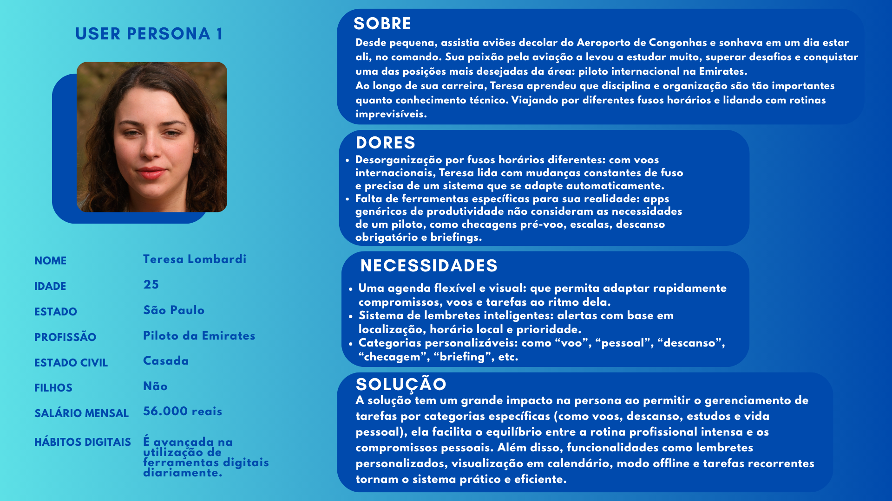 
  Fonte: Desenvolvido por Mirela Bianchi

Ao desenvolver personas como a Teresa, o projeto ganha direção e foco, permitindo decisões de design e funcionalidade mais assertivas. Elas servem como guias durante todo o processo de criação do sistema, garantindo que as ferramentas oferecidas realmente atendam às expectativas dos usuários reais, tornando o projeto mais humano, eficiente e alinhado com as necessidades da aviação profissional.

### 2.2. User Stories 

User Stories são descrições curtas e claras de funcionalidades, escritas do ponto de vista do usuário final. Elas ajudam a entender as necessidades do usuário, facilitando a criação de soluções que atendem diretamente aos seus objetivos e desafios.

| ID   | User Story Persona 1                                                                                                        | Critério de Aceite 1                                                                 | Critério de Aceite 2                                                                 |
|------|--------------------------------------------------------------------------------------------------------------------|---------------------------------------------------------------------------------------|---------------------------------------------------------------------------------------|
| US01 | Como piloto, quero cadastrar tarefas por categorias específicas (voo, descanso, pessoal), para que eu possa organizar melhor minha rotina. | O sistema permite selecionar uma categoria ao criar a tarefa.                         | As tarefas são listadas separadamente por categoria no painel.                       |
| US02 | Como piloto, quero visualizar meu calendário mensal com todas as tarefas, para que eu possa me planejar com antecedência.                     | O sistema exibe um calendário com todas as tarefas organizadas por data.              | É possível clicar em um dia específico e ver suas tarefas detalhadas.                |
| US03 | Como piloto, quero receber lembretes automáticos antes dos voos e eventos importantes, para que eu não perca nenhum compromisso.              | O sistema envia notificações com base no horário da tarefa.                           | O usuário pode configurar quanto tempo antes deseja receber o lembrete.              |
| US04 | Como piloto, quero acessar minha rotina e atividades por meio de um local seguro com design bem estruturado e funcional, para que somente eu tenha acesso às minhas informações e entenda o site.              | O sistema possui tela de inicio mostrando suas funcionalidades gerais.                           | O usuário tem que utilizar seu e-mail e senha individuais para acessar as suas informações.              |

---

### Análise INVEST – US01

**User Story:**
> Como piloto, quero cadastrar tarefas por categorias específicas (voo, descanso, pessoal), para que eu possa organizar melhor minha rotina.

| Critério  | Justificativa                                                                                       |
|-----------|-----------------------------------------------------------------------------------------------------|
| I – Independente | Pode ser implementada separadamente de outras funcionalidades, como calendário ou lembretes.   |
| N – Negociável   | As categorias podem ser ajustadas ou personalizadas conforme o feedback dos usuários.         |
| V – Valiosa      | Ajuda diretamente na organização do piloto, considerando sua rotina intensa e segmentada.    |
| E – Estimável    | Pode ser facilmente estimada durante o desenvolvimento com base nas funcionalidades requeridas. |
| S – Pequena      | A funcionalidade pode ser implementada em poucos passos: criação, edição e visualização por categoria. |
| T – Testável     | Pode ser testada criando tarefas com diferentes categorias e verificando se estão organizadas corretamente. |

Dessa forma, as User Stories são importantes para o projeto, pois garantem que as funcionalidades atendam às necessidades reais dos pilotos, melhorando a usabilidade e a relevância do sistema.

---

## 3. Projeto da Aplicação Web

### 3.1. Modelagem do banco de dados 

##### Visão maximalista do diagrama do BD
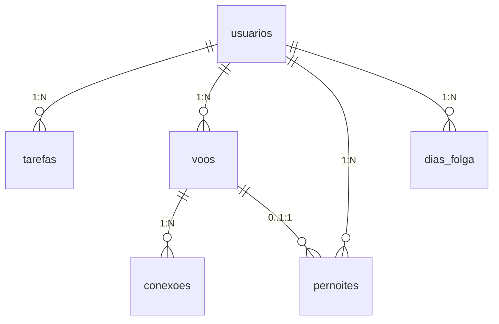
```mermaid
erDiagram
    usuarios ||--o{ tarefas : "1:N"
    usuarios ||--o{ voos : "1:N"
    usuarios ||--o{ pernoites : "1:N"
    usuarios ||--o{ dias_folga : "1:N"
    voos ||--o{ conexoes : "1:N"
    voos ||--o{ pernoites : "0..1:1"
```

##### Entidades e Relacionamentos:

##### Usuários (`usuarios`)
Representam os pilotos. Cada piloto possui:
- Nome
- E-mail
- Tipo de licença
- Total de horas de voo
- Aeroporto base

**Relacionamentos:**
- Um usuário pode ter várias tarefas, voos, pernoites e dias de folga.

---

#### Tarefas (`tarefas`)
Representam compromissos organizados por categoria:
- Categoria (voo, descanso, pessoal)
- Data
- Horários
- Prioridade
- Status

**Relacionamentos:**
- Cada tarefa pertence a um único usuário.

---

#### Voos (`voos`)
Guardam informações sobre:
- Origem
- Destino
- Horários
- Duração

**Relacionamentos:**
- Cada voo pertence a um único usuário.
- Pode estar relacionado a uma ou mais conexões.
- Pode estar relacionado a um pernoite.

---

#### Pernoites (`pernoites`)
Registram:
- Local de hospedagem
- Tempo de permanência

**Relacionamentos:**
- Um pernoite pode estar vinculado a um voo específico.
- Sempre vinculado a um usuário.

---

#### Dias de Folga (`dias_folga`)
Representam:
- Data da folga
- Motivo (opcional)
- Tipo (programada/ocasional)

**Relacionamentos:**
- Cada dia de folga pertence a um único usuário.

---

#### Conexões (`conexoes`)
Conectam dois voos consecutivos:
- Tempo entre os voos
- IDs dos voos conectados

**Relacionamentos:**
- Cada conexão liga dois voos diferentes por meio de seus respectivos IDs.

  Diagrama do banco de dados completo: 
   
  Fonte: Desenvolvido por Mirela Bianchi

#### Modelo físico com o Schema do BD
📥 [Schema SQL completo](../scripts/init.sql)

### 3.1.1 BD e Models (Semana 5)
*Descreva aqui os Models implementados no sistema web*

### 3.2. Arquitetura (Semana 5)

*Posicione aqui o diagrama de arquitetura da sua solução de aplicação web. Atualize sempre que necessário.*

**Instruções para criação do diagrama de arquitetura**  
- **Model**: A camada que lida com a lógica de negócios e interage com o banco de dados.
- **View**: A camada responsável pela interface de usuário.
- **Controller**: A camada que recebe as requisições, processa as ações e atualiza o modelo e a visualização.
  
*Adicione as setas e explicações sobre como os dados fluem entre o Model, Controller e View.*

### 3.3. Wireframes 

####  Tela de início
Essa tela atende os requisitos da US04, utilizando de um design bem estruturado e intuitivo para mostrar as funcionalidades do site para que assim que os pilotos acessarem, eles já saibam quais ferramentas terão ao seu dispor.

  Tela inicial: 
  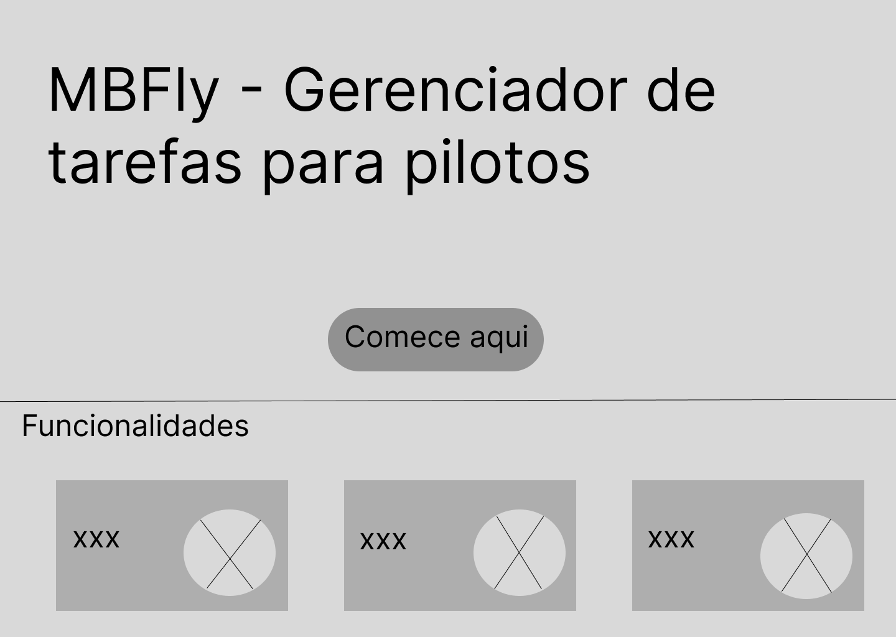 
  Fonte: Desenvolvido por Mirela Bianchi

####  Login
Essa tela atende diretamente os requisitos da US04, utilizando de e-mail e senha do piloto a fim de que somente ele consiga acessar as suas informações e rotina de forma individual e segura.

  Tela de login: 
  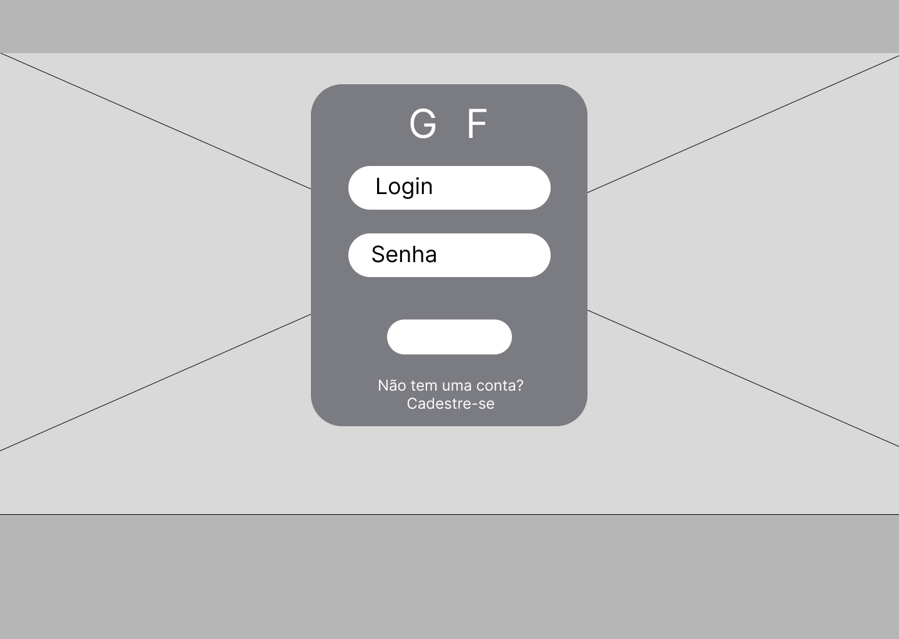 
  Fonte: Desenvolvido por Mirela Bianchi

####  Calendário
Essa tela atende diretamente os requisitos da US01, mostrando para o piloto os seus calendários e suas marcações de tarefas para cada dia da semana.

  Tela do calendário: 
  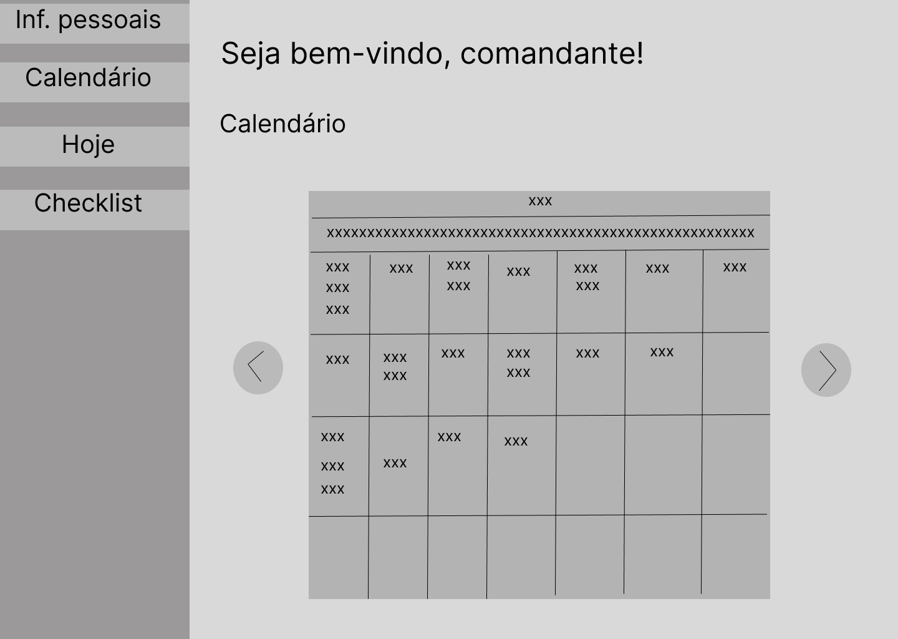 
  Fonte: Desenvolvido por Mirela Bianchi

####  Dias da semana
Essa tela atende diretamente ao segundo critério de aceite da US02, em que o piloto pode clicar no dia da semana em que ele está (hoje) e visualizar suas tarefas, que serão marcadas por ele como "pendentes" ou "feitas" e por ordem de prioridade.

  Tela dos dias da semana: 
  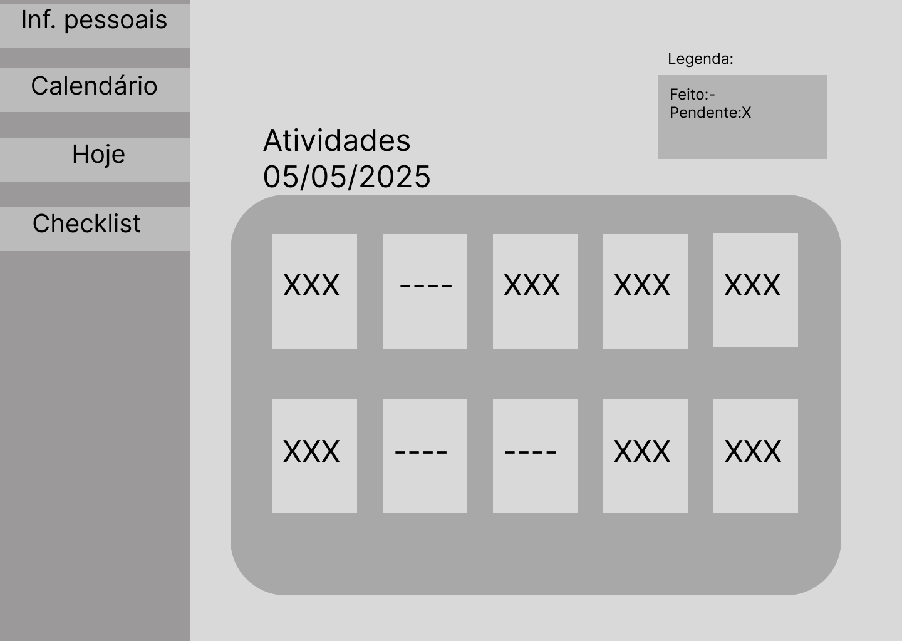 
  Fonte: Desenvolvido por Mirela Bianchi

####  Informações pessoais
Essa tela atende às questões que o piloto trás sobre sua organização pessoal e demandas específicas da área da aviação, mostrando as suas horas de voo, certificações e lugares que já esteve (US01).

  Tela das informações pessoais: 
  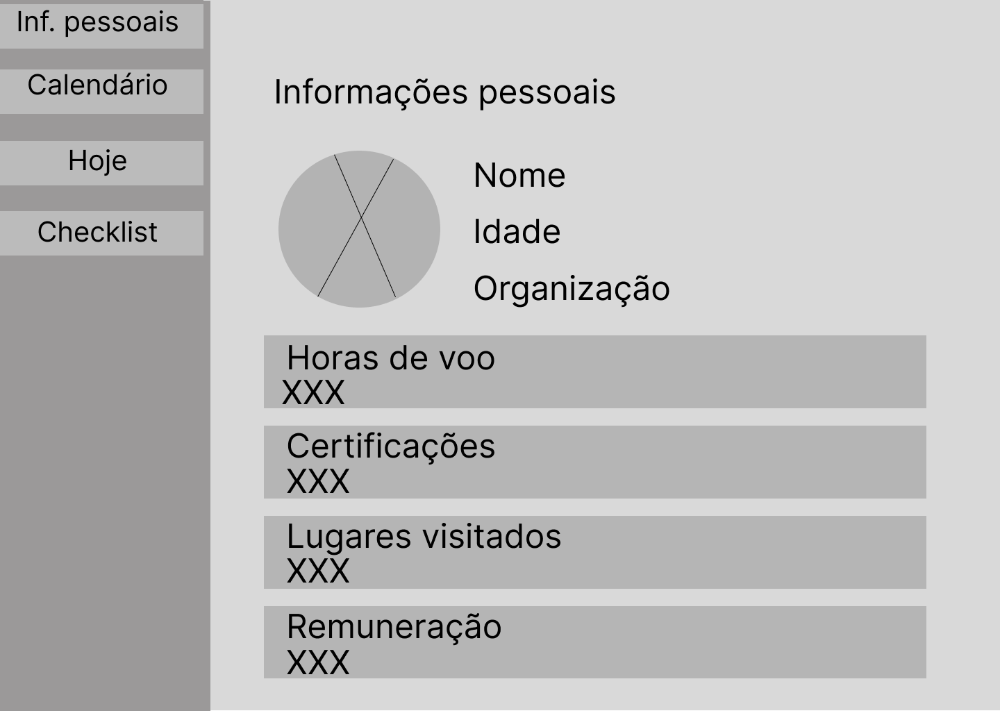 
  Fonte: Desenvolvido por Mirela Bianchi

#### Checklist pré voo
Esta tela atende diretamente às necessidades operacionais do piloto, organizando as tarefas específicas de voo (US01) e servindo como base para os lembretes automáticos (US03) antes dos compromissos importantes.

  Tela do Checklist pré voo: 
  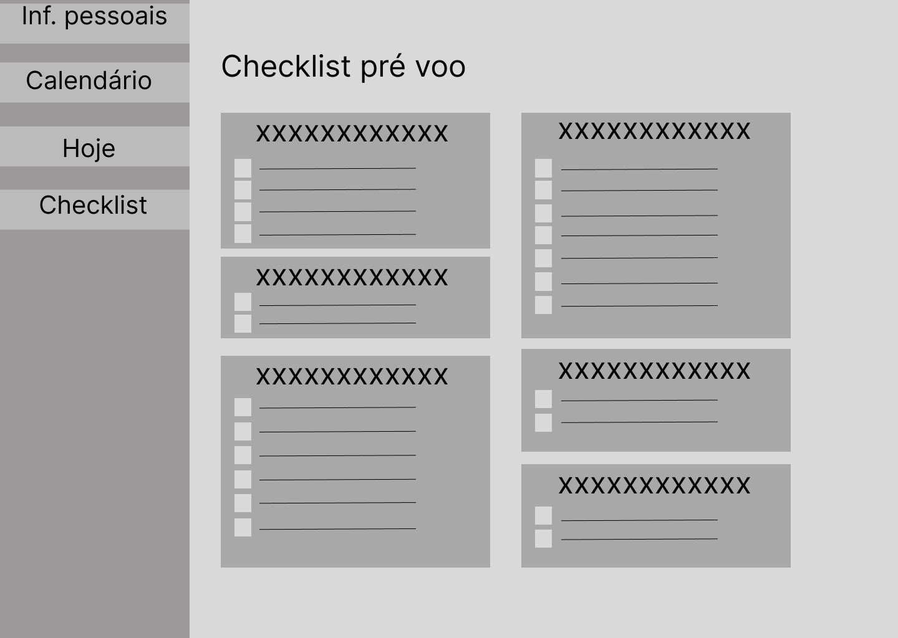 
  Fonte: Desenvolvido por Mirela Bianchi

### 3.4. Guia de estilos 

Um guia de estilos é um documento que define padrões visuais e comportamentais para a interface de um sistema. Ele reúne elementos como paleta de cores, tipografia, espaçamento, ícones, botões e demais componentes gráficos, garantindo que o design mantenha coerência e identidade visual em todas as telas. Serve como uma referência para desenvolvedores e designers, promovendo consistência e facilitando futuras manutenções e expansões do projeto.

  Guia de estilos: 
  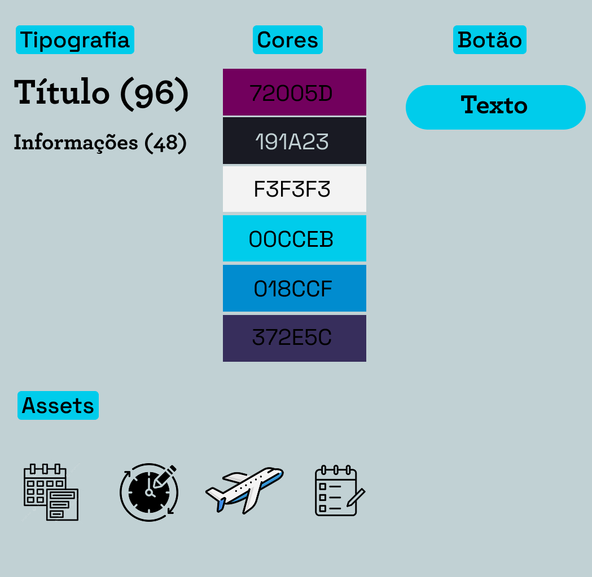 
  Fonte: Desenvolvido por Mirela Bianchi

#### Explicação:
Este é o guia de estilos desenvolvido especialmente para a tela principal do projeto MBFly, a tela de início, que apresenta as funcionalidades centrais do sistema. O objetivo foi criar uma identidade visual clara, moderna e funcional para facilitar a navegação dos usuários. As cores foram escolhidas para equilibrar contraste e acessibilidade: tons claros (como o branco #FFFFFF) são usados para destacar elementos importantes como títulos e ícones. Já o azul-claro #00CCEB foi reservado exclusivamente para botões, criando um ponto de destaque que facilita a identificação de ações interativas na tela.

Os retângulos coloridos representam a paleta de cores utilizada em todo o projeto, cada um com função específica: alguns para textos, outros para o fundo (demonstrando a identidade visual do sistema, em que suas cores principais de forma hierarquica são o roxo e o azul céu). A tipografia segue dois tamanhos distintos – 96 para títulos e 48 para informações – refletindo a hierarquia visual da tela de início, onde o título tem destaque e os textos informativos complementam a navegação. A diferença de cor entre as fontes também reforça essa hierarquia e melhora a leitura.

Quanto aos ícones, eles foram escolhidos no estilo outline (contorno), por serem visuais, leves e modernos, alinhados ao tema da aviação digital, e eles todos são ícones de referência, que usam analogias para representar conceitos abstratos.

  Layout e grides: 
  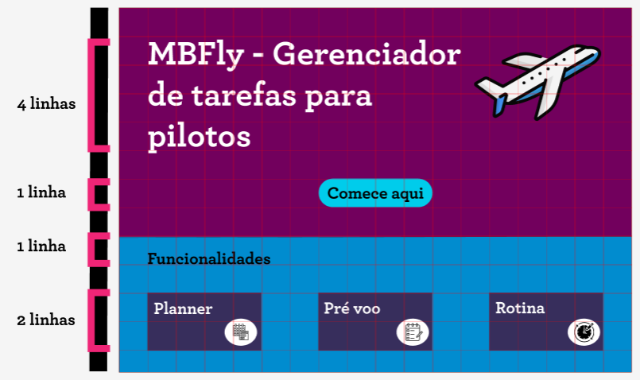 
  Fonte: Desenvolvido por Mirela Bianchi

#### Explicação:

Este layout representa a tela inicial do MBFly, estruturada com base em um grid de colunas e linhas, que garante alinhamento, organização e equilíbrio visual entre os elementos. O uso de grades visuais (grids) facilita o posicionamento dos componentes na interface, criando uma hierarquia clara e consistente entre título, botão e funcionalidades. O título ocupa 4 linhas, dando destaque e prioridade à mensagem principal. A separação entre o título, botão e as funcionalidades é feita por espaços estratégicos de 1 linha, o que melhora a leitura e evita a poluição visual.

A parte inferior, com fundo azul, destaca as principais funcionalidades do sistema, organizadas em três blocos simétricos, cada um com seu respectivo ícone e legenda, todos posicionados com base no mesmo grid. O botão “Comece aqui” está centralizado e destacado com uma cor exclusiva, seguindo o guia de estilos. Esse uso intencional de espaçamento e alinhamento é essencial para a usabilidade e acessibilidade, pois guia o olhar do usuário de forma fluida e intuitiva, além de reforçar a identidade visual e profissionalismo do projeto.

Sendo assim, no contexto do MBFly, o guia de estilos é essencial para assegurar que a experiência do usuário seja fluida, clara e alinhada às necessidades dos pilotos. Através dele, é possível manter uma identidade visual coesa, reforçar a usabilidade e agilizar o desenvolvimento das interfaces, pois cada componente visual segue uma lógica previamente definida.

### 3.5. Protótipo de alta fidelidade 

Um protótipo de alta fidelidade é uma representação visual detalhada do sistema final, com aparência, interações e funcionalidades próximas da versão real. Diferente dos esboços iniciais, ele inclui elementos gráficos precisos, navegação realista e simula com fidelidade como o usuário final vai interagir com o sistema. 

  Tela de início (principal): 
  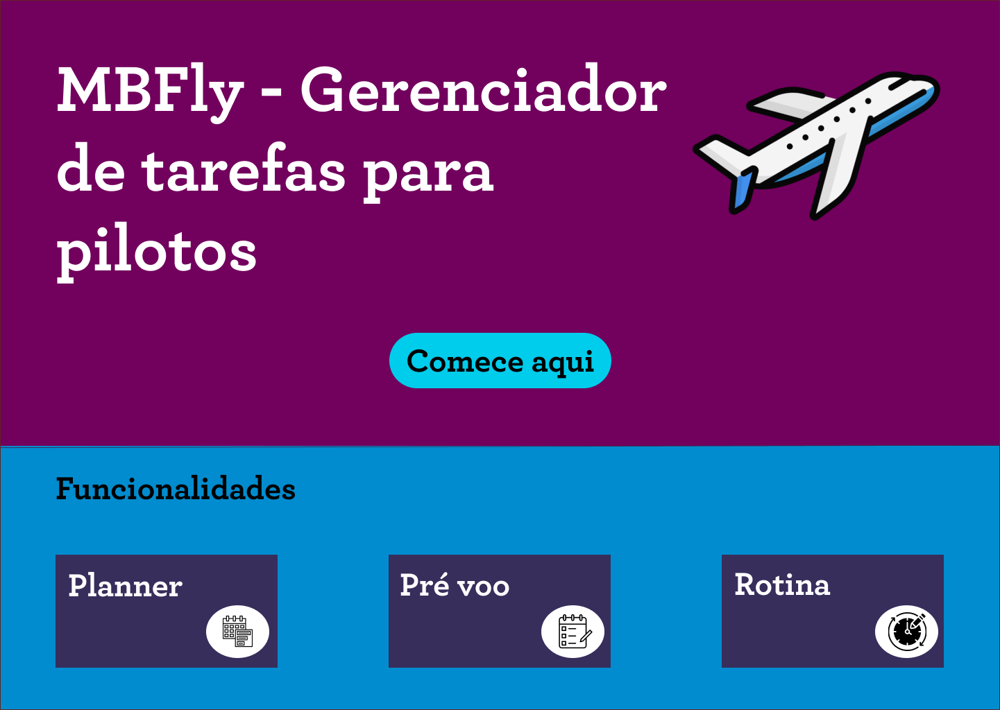 
  Fonte: Desenvolvido por Mirela Bianchi

A tela de início foi projetada para ser clara, objetiva e intuitiva, cumprindo a US04, que pede um site funcional e compreensível desde o primeiro acesso. O layout apresenta blocos com ícones e cores suaves, permitindo ao piloto entender rapidamente as funcionalidades principais, como calendário, tarefas e voos. A escolha por um fundo branco com elementos em tons de azul e cinza traz seriedade e remete ao ambiente aeronáutico, ao mesmo tempo que favorece a leitura em diferentes dispositivos.

  Tela de login: 
  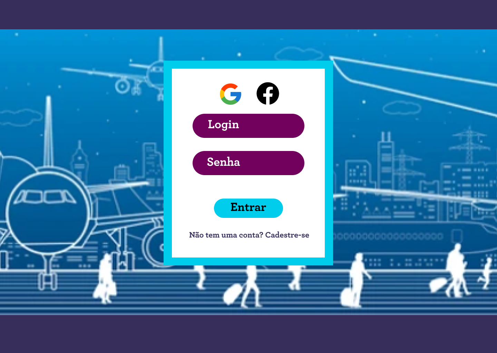 
  Fonte: Desenvolvido por Mirela Bianchi

Relacionada diretamente à US04, esta tela garante que cada piloto possa acessar apenas seus próprios dados, através de um login seguro por e-mail e senha. O layout segue a mesma linha visual das outras telas, com cores neutras e tipografia clara, reforçando a identidade visual e promovendo uma navegação sem distrações.

  Tela de cadastro: 
  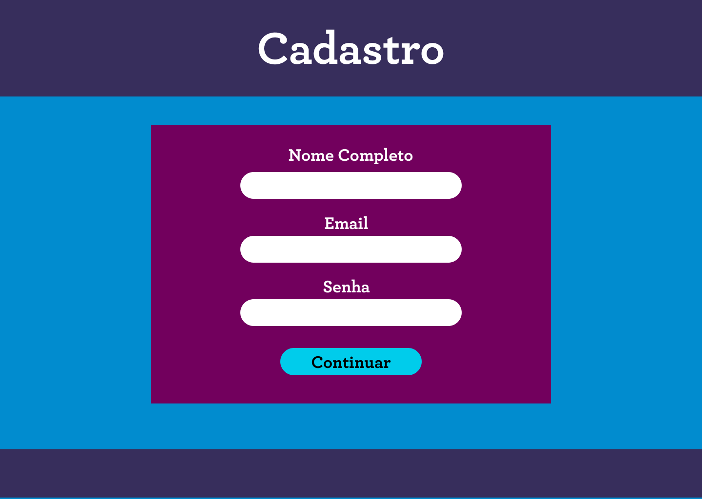 
  Fonte: Desenvolvido por Mirela Bianchi

Essa tela complementa a tela de login, facilitando o primeiro acesso do piloto ao sistema. O uso de campos bem espaçados e botões em azul escuro, contrastando com o fundo claro, garante boa usabilidade e acessibilidade. O design minimalista reflete a proposta de foco e organização do MBFly, reforçando os princípios da US04, que trata da segurança e privacidade das informações do usuário.

  Tela de Calendario: 
  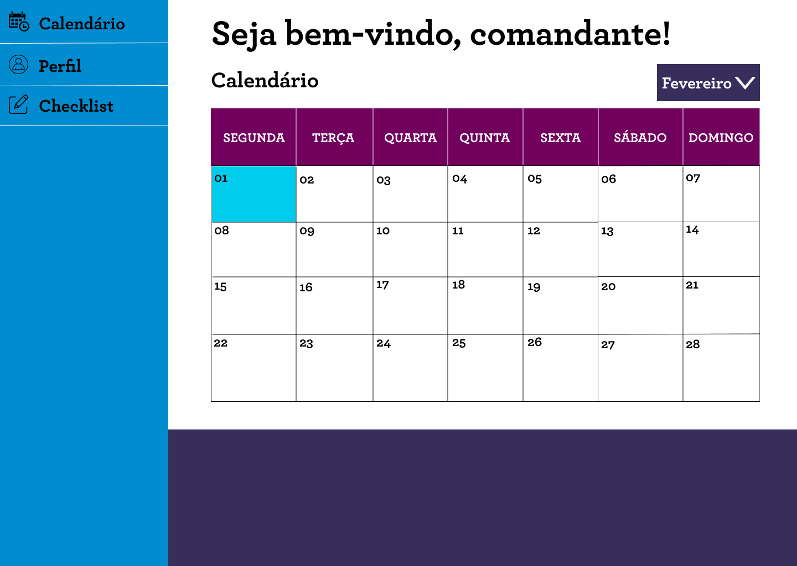 
  Fonte: Desenvolvido por Mirela Bianchi

A tela de calendário responde aos critérios da US02, permitindo que o piloto visualize todas as suas tarefas organizadas por dia, mês e prioridade. O design em formato de grade, com cores suaves para os dias e marcadores coloridos para indicar o dia vigente, facilita o planejamento visual. O toque moderno e organizado da interface ajuda a manter o foco, mesmo em rotinas exigentes.

  Tela de informações pessoais: 
  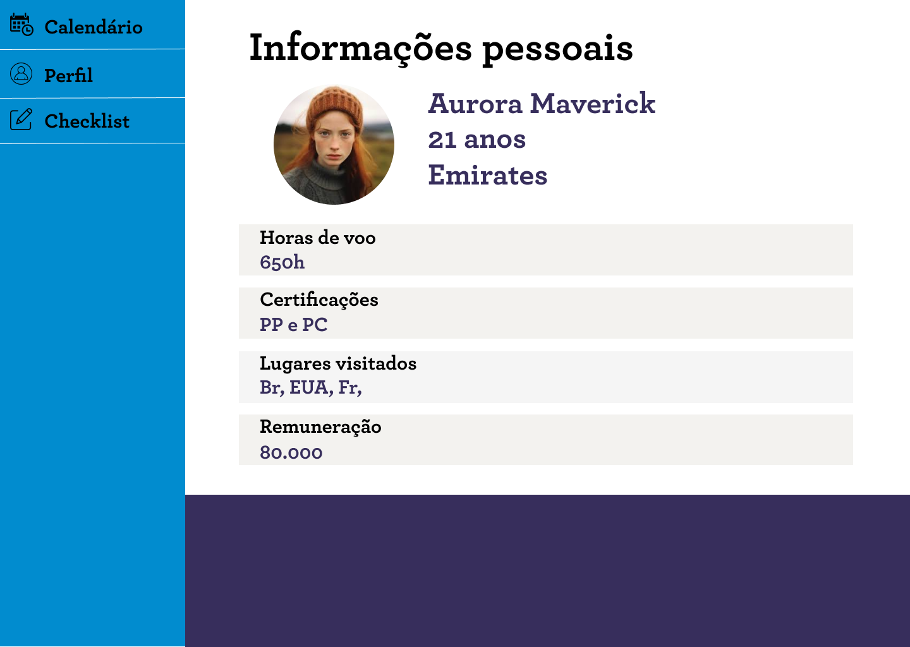 
  Fonte: Desenvolvido por Mirela Bianchi

Essa tela representa um painel de controle do piloto, centralizando dados como horas de voo, destinos visitados e licenças. Atende às funcionalidades previstas na US01, pois oferece uma visão organizada das tarefas e registros pessoais. A interface foi pensada para ser objetiva, com ícones temáticos e gráficos simples, promovendo clareza e acompanhamento de metas de forma visualmente agradável.

  Tela de compromissos: 
  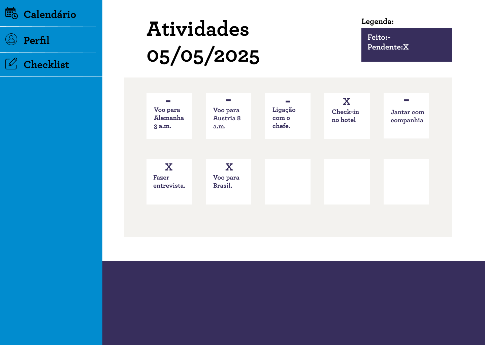 
  Fonte: Desenvolvido por Mirela Bianchi

Aqui o piloto pode visualizar suas tarefas detalhadas do dia e da semana atual, atendendo ao segundo critério de aceite da US02. A segmentação por status (pendente/feito) torna a rotina mais gerenciável. Esse sistema de marcadores foi escolhido para oferecer um feedback visual rápido, com uma interface leve.

  Tela de checklist pré voo: 
  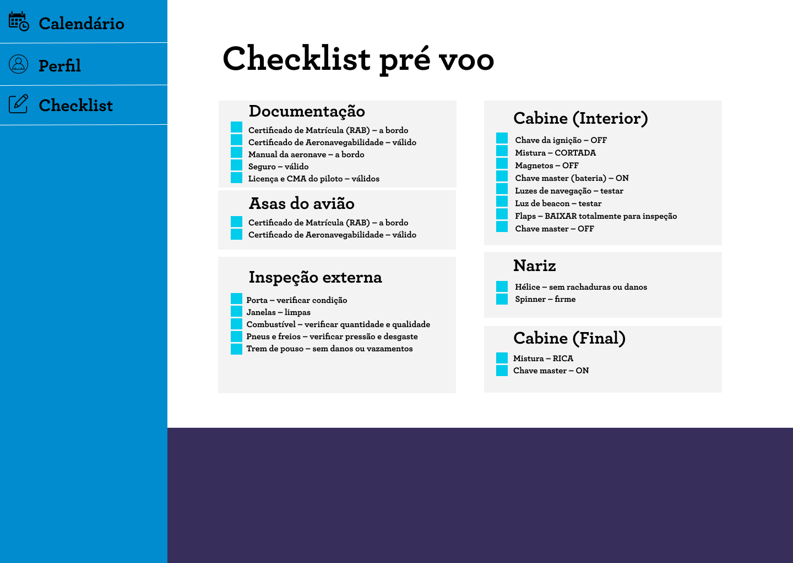 
  Fonte: Desenvolvido por Mirela Bianchi

Essa tela atende diretamente à US01 e à US03, ao organizar as tarefas específicas de cada voo e possibilitar que lembretes sejam disparados antes dos eventos. Essa tela tem um visual mais técnico, remetendo ao checklist real usado em operações de voo, com campos bem definidos e ícones representativos. O layout contribui para que o piloto não esqueça etapas importantes e ganhe confiança no cumprimento de sua agenda

Sendo assim, no projeto MBFly, o protótipo de alta fidelidade foi fundamental para validar as escolhas de design, organização das telas e usabilidade do sistema antes mesmo do início da programação. Ele permitirá testar a interface com usuários, identificar melhorias e alinhar a proposta visual com os objetivos definidos nas user stories, garantindo uma construção mais assertiva e eficiente da aplicação final.

##### Acesso pela ferramenta:
[Link do protótipo pelo Figma](https://www.figma.com/design/oW9LgcQopR4yJSiIe70lHm/Untitled?node-id=0-1&t=51CFUGBKmgmNYbwf-1)

### 3.6. WebAPI e endpoints (Semana 05)

*Utilize um link para outra página de documentação contendo a descrição completa de cada endpoint. Ou descreva aqui cada endpoint criado para seu sistema.*  

### 3.7 Interface e Navegação (Semana 07)

*Descreva e ilustre aqui o desenvolvimento do frontend do sistema web, explicando brevemente o que foi entregue em termos de código e sistema. Utilize prints de tela para ilustrar.*

---

## 4. Desenvolvimento da Aplicação Web (Semana 8)

### 4.1 Demonstração do Sistema Web (Semana 8)

*VIDEO: Insira o link do vídeo demonstrativo nesta seção*
*Descreva e ilustre aqui o desenvolvimento do sistema web completo, explicando brevemente o que foi entregue em termos de código e sistema. Utilize prints de tela para ilustrar.*

### 4.2 Conclusões e Trabalhos Futuros (Semana 8)

*Indique pontos fortes e pontos a melhorar de maneira geral.*
*Relacione também quaisquer outras ideias que você tenha para melhorias futuras.*

## 5. Referências

_Incluir as principais referências de seu projeto, para que seu parceiro possa consultar caso ele se interessar em aprofundar. Um exemplo de referência de livro e de site:_ 

---
---
